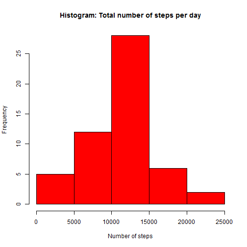
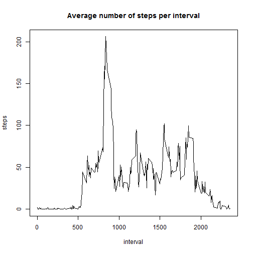
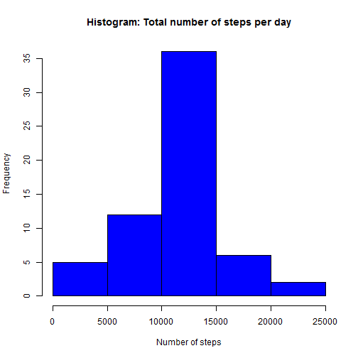
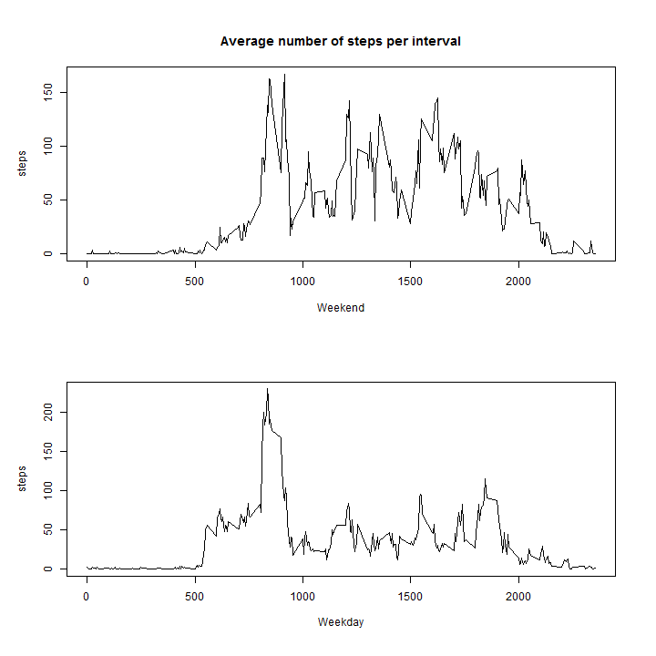

---
title: "Reproducible Research: Peer Assessment 1"
output: 
  html_document:
    keep_md: true
---


## Loading and preprocessing the data

```r
library(dplyr)
originaldata <- read.csv("activity.csv")
data <- filter(originaldata, !is.na(steps))
intervaldata <- group_by(data, interval)
intervaldata <- summarise(intervaldata, steps=mean(steps))
data <- group_by(data, date)
data <- summarise(data, steps=sum(steps))
```


## What is mean total number of steps taken per day?

```r
summary(data)
```

```
##          date        steps      
##  2012-10-02: 1   Min.   :   41  
##  2012-10-03: 1   1st Qu.: 8841  
##  2012-10-04: 1   Median :10765  
##  2012-10-05: 1   Mean   :10766  
##  2012-10-06: 1   3rd Qu.:13294  
##  2012-10-07: 1   Max.   :21194  
##  (Other)   :47
```

```r
hist(as.matrix(data[,"steps"]), main="Histogram: Total number of steps per day", xlab = "Number of steps", col="red")
```

 

```r
mean <- mean(as.matrix(data[,"steps"]))
median <- median(as.matrix(data[,"steps"]))
paste("The mean number of steps per day is", mean)
```

```
## [1] "The mean number of steps per day is 10766.1886792453"
```

```r
paste("The median number of steps per day is", median)
```

```
## [1] "The median number of steps per day is 10765"
```


## What is the average daily activity pattern?

```r
summary(intervaldata)
```

```
##     interval          steps        
##  Min.   :   0.0   Min.   :  0.000  
##  1st Qu.: 588.8   1st Qu.:  2.486  
##  Median :1177.5   Median : 34.113  
##  Mean   :1177.5   Mean   : 37.383  
##  3rd Qu.:1766.2   3rd Qu.: 52.835  
##  Max.   :2355.0   Max.   :206.170
```

```r
plot(intervaldata, type="l", main="Average number of steps per interval")
```

 

```r
maxdata <- filter(intervaldata, steps==max(steps))
paste("The interval with the max average number of steps is", maxdata["interval"])
```

```
## [1] "The interval with the max average number of steps is 835"
```


## Imputing missing values

```r
missingcount = nrow(filter(originaldata, is.na(steps)))
paste("Number of missing values for step count is", missingcount)
```

```
## [1] "Number of missing values for step count is 2304"
```

```r
filledindata <- originaldata
for(i in unique(originaldata["interval"])){
    filledindata[filledindata["interval"]==i & is.na(filledindata["steps"]),"steps"] <- intervaldata[intervaldata["interval"]==i,"steps"]
}  
filledindata2 <- group_by(filledindata, date)
filledindata2 <- summarise(filledindata2, steps=sum(steps))
summary(filledindata2)
```

```
##          date        steps      
##  2012-10-01: 1   Min.   :   41  
##  2012-10-02: 1   1st Qu.: 9819  
##  2012-10-03: 1   Median :10766  
##  2012-10-04: 1   Mean   :10766  
##  2012-10-05: 1   3rd Qu.:12811  
##  2012-10-06: 1   Max.   :21194  
##  (Other)   :55
```

```r
hist(as.matrix(filledindata2[,"steps"]), main="Histogram: Total number of steps per day", xlab = "Number of steps", col="blue")
```

 

```r
mean <- mean(as.matrix(filledindata2[,"steps"]))
median <- median(as.matrix(filledindata2[,"steps"]))
paste("The mean number of infilled steps per day is", mean)
```

```
## [1] "The mean number of infilled steps per day is 10766.1886792453"
```

```r
paste("The median number of infilled steps per day is", median)
```

```
## [1] "The median number of infilled steps per day is 10766.1886792453"
```


## Are there differences in activity patterns between weekdays and weekends?

```r
filledindata$day <- weekdays(as.Date(filledindata$date))
filledindata$weekend <- (filledindata$day=="Sunday" | filledindata$day=="Saturday")
weekenddata <- filter(filledindata, weekend==TRUE)
weekdata  <- filter(filledindata, weekend==FALSE)
par(mfrow = c(2, 1), oma=c(1,1,1,1))
weekenddata <- group_by(weekenddata, interval)
weekenddata <- summarise(weekenddata, steps=mean(steps))
plot(weekenddata, type="l", main="Average number of steps per interval", xlab="Weekend")

weekdata <- group_by(weekdata, interval)
weekdata <- summarise(weekdata, steps=mean(steps))
plot(weekdata, type="l", xlab="Weekday")
```

 


